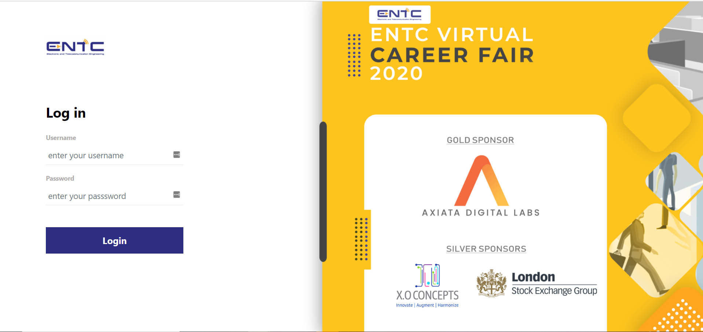

# ENTC Career Fair (2020) Website

## Setup

Dependancies

- NodeJS ([download](https://nodejs.org/en/download/))
- Firebase CLI ([download](https://firebase.google.com/docs/cli))

File Structure

- Use `careerfair2020/` folder for the angular application
- Use `firebase/` folder to backup firebase scripts, rules etc.

### For Development

1. Clone repo `git clone https://github.com/pulasthieka/careerfair.git`
2. Navigate to the Angular application folder `cd careerfair2020`
3. Install necessary packages `npm install --dev`
4. Run application in developer mode `ng serve`

### For Production

1. Navigate to the Angular application folder `cd careerfair2020`
2. Install necessary packages `npm install`
3. Update firebase variables for production [here](careerfair2020/src/environments/environment.prod.ts)
4. Build the application for deployment `ng build -prod`
5. Install [Firebase CLI](https://firebase.google.com/docs/cli#install_the_firebase_cli). During the first time setup projects and accounts
6. Navigate to Firebase Folder `cd ../firebase`
7. Deploy to firebase `firebase deploy`

## Limitations

A company can have only one coordinator and each coordinator can oversee only one company. Coordinators and companies can have multiple panels.
